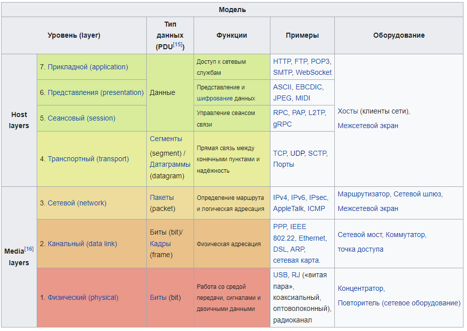
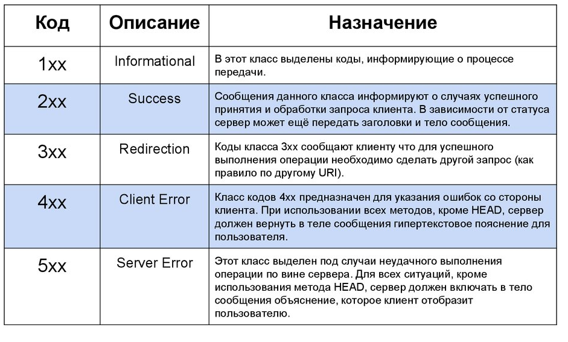
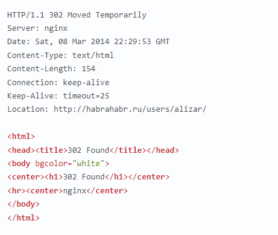
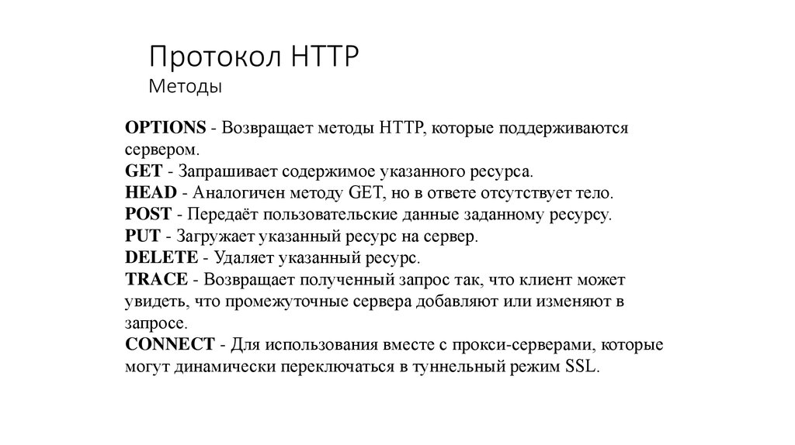

В основе сетевого взаимодействия лежит OSI (Open Systems Interconnection) модель

# Уровень 1: Физический

Здесь происходит обмен оптическими, электрическими или радиосигналами между устройствами отправителя и получателя.
Физический уровень (англ. physical layer) — нижний уровень модели, который определяет метод передачи данных, представленных в двоичном виде, от одного устройства (компьютера) к другому.

# Уровень 2: Канальный

Канальный уровень (англ. data link layer) предназначен для обеспечения взаимодействия сетей на физическом уровне и контроля ошибок, которые могут возникнуть. Полученные с физического уровня данные, представленные в битах, он упаковывает в кадры, проверяет их на целостность и, если нужно, исправляет ошибки (либо формирует повторный запрос повреждённого кадра) и отправляет на сетевой уровень. Канальный уровень может взаимодействовать с одним или несколькими физическими уровнями, контролируя и управляя этим взаимодействием.

Спецификация IEEE 802 разделяет этот уровень на два подуровня: MAC (англ. media access control) регулирует доступ к разделяемой физической среде, LLC (англ. logical link control) обеспечивает обслуживание сетевого уровня.

На этом уровне работают коммутаторы, мосты и другие устройства. Эти устройства используют адресацию второго уровня (по номеру уровня в модели OSI).

# Уровень 3: Сетевой

Сетевой уровень (англ. network layer) модели предназначен для определения пути передачи данных. Отвечает за трансляцию логических адресов и имён в физические, определение кратчайших маршрутов, коммутацию и маршрутизацию, отслеживание неполадок и «заторов» в сети.
Протоколы сетевого уровня маршрутизируют данные от источника к получателю. Работающие на этом уровне устройства (маршрутизаторы) условно называют устройствами третьего уровня (по номеру уровня в модели OSI).

# Уровень 4: Транспортный

Транспортный уровень (англ. transport layer) модели предназначен для обеспечения надёжной передачи данных от отправителя к получателю. При этом уровень надёжности может варьироваться в широких пределах. Существует множество классов протоколов транспортного уровня, начиная от протоколов, предоставляющих только основные транспортные функции (например, функции передачи данных без подтверждения приёма), и заканчивая протоколами, которые гарантируют доставку в пункт назначения нескольких пакетов данных в надлежащей последовательности, мультиплексируют несколько потоков данных, обеспечивают механизм управления потоками данных и гарантируют достоверность принятых данных. Например, UDP ограничивается контролем целостности данных в рамках одной датаграммы и не исключает возможности потери пакета целиком или дублирования пакетов, нарушение порядка получения пакетов данных; TCP обеспечивает надёжную непрерывную передачу данных, исключающую потерю данных или нарушение порядка их поступления или дублирования, может перераспределять данные, разбивая большие порции данных на фрагменты и наоборот, склеивая фрагменты в один пакет.

# Уровень 5: Сеансовый

Сеансовый уровень (англ. session layer) модели обеспечивает поддержание сеанса связи, позволяя приложениям взаимодействовать между собой длительное время. Уровень управляет созданием/завершением сеанса, обменом информацией, синхронизацией задач, определением права на передачу данных и поддержанием сеанса в периоды неактивности приложений.

# Уровень 6: Уровень представления

Уровень представления (англ. presentation layer) обеспечивает преобразование протоколов и кодирование/декодирование данных. Запросы приложений, полученные из сеансового уровня, на уровне представления преобразуются в формат для передачи по сети, а полученные из сети данные преобразуются в формат приложений. На этом уровне может осуществляться сжатие/распаковка или шифрование/дешифрование, а также перенаправление запросов другому сетевому ресурсу, если они не могут быть обработаны локально.

Уровень представлений обычно представляет собой промежуточный протокол для преобразования информации из соседних уровней. Это позволяет осуществлять обмен между приложениями на разнородных компьютерных системах прозрачным для приложений образом. Уровень представлений обеспечивает форматирование и преобразование кода. Форматирование кода используется для того, чтобы гарантировать приложению поступление информации для обработки, которая имела бы для него смысл. При необходимости этот уровень может выполнять перевод из одного формата данных в другой.

Уровень представлений имеет дело не только с форматами и представлением данных, он также занимается структурами данных, которые используются программами. Таким образом, уровень 6 обеспечивает организацию данных при их пересылке.

Чтобы понять, как это работает, представим, что имеются две системы. Одна использует для представления данных расширенный двоичный код обмена информацией EBCDIC, например, это может быть мейнфрейм компании IBM, а другая — американский стандартный код обмена информацией ASCII (его использует большинство других производителей компьютеров). Если этим двум системам необходимо обменяться информацией, то нужен уровень представлений, который выполнит преобразование и осуществит перевод между двумя различными форматами.

Другой функцией, выполняемой на уровне представлений, является шифрование данных, которое применяется в тех случаях, когда необходимо защитить передаваемую информацию от доступа несанкционированными получателями. Чтобы решить эту задачу, процессы и коды, находящиеся на уровне представлений, должны выполнить преобразование данных. На этом уровне существуют и другие подпрограммы, которые сжимают тексты и преобразовывают графические изображения в битовые потоки, так, что они могут передаваться по сети.

Стандарты уровня представлений также определяют способы представления графических изображений. Для этих целей может использоваться формат PICT — формат изображений, применяемый для передачи графики QuickDraw между программами.

Другим форматом представлений является тэгированный формат файлов изображений TIFF, который обычно используется для растровых изображений с высоким разрешением. Следующим стандартом уровня представлений, который может использоваться для графических изображений, является стандарт, разработанный Объединённой экспертной группой по фотографии (Joint Photographic Expert Group); в повседневном пользовании этот стандарт называют просто JPEG.

# Уровень 7: Прикладной

Прикладной уровень (уровень приложений; англ. application layer) — верхний уровень модели, обеспечивающий взаимодействие пользовательских приложений с сетью:

позволяет приложениям использовать сетевые службы:
удалённый доступ к файлам и базам данных,
пересылка электронной почты;
отвечает за передачу служебной информации;
предоставляет приложениям информацию об ошибках;
формирует запросы к уровню представления.
Протоколы прикладного уровня: RDP, HTTP, SMTP, SNMP, POP3, FTP, XMPP, OSCAR, Modbus, SIP, TELNET и другие.

Определения протокола прикладного уровня и уровня представления очень размыты, и принадлежность протокола к тому или иному уровню, например протокола HTTPS зависит от конечного сервиса который предоставляет приложение.

# коды ошибок

# Структура HTTP

Сразу стоит отметить, что HTTP-протокол состоит только из текста. Ну а нас больше всего интересует структура, в которой расположен этот текст.

Каждое сообщение состоит из трех частей:
Стартовая строка (Starting line) — определяет служебные данные.
Заголовки (Headers) — описание параметров сообщения.
Тело сообщения (Body) — данные сообщения. Должны отделяться от заголовков пустой строкой.

**Пример http запроса:**

GET / HTTP/1.1

Host: ya.ru

User-Agent: firefox/5.0 (Linux; Debian 5.0.8; en-US; rv:1.8.1.7)

**Пример http ответа**

# HTTP VS HTTPS

Сам по себе протокол HTTP не предполагает использование шифрования для передачи информации. Тем не менее, для HTTP есть распространённое расширение, которое реализует упаковку передаваемых данных в криптографический протокол SSL или TLS.

Название этого расширения — HTTPS (HyperText Transfer Protocol Secure). Для HTTPS-соединений обычно используется TCP-порт 443. HTTPS широко используется для защиты информации от перехвата, а также, как правило, обеспечивает защиту от атак вида man-in-the-middle — в том случае, если сертификат проверяется на клиенте, и при этом приватный ключ сертификата не был скомпрометирован, пользователь не подтверждал использование неподписанного сертификата, и на компьютере пользователя не были внедрены сертификаты центра сертификации злоумышленника.

На данный момент HTTPS поддерживается всеми популярными веб-браузерами.

